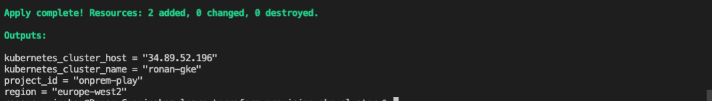

# Learn Terraform - Provision a GKE Cluster

This repo is a companion repo to the [Provision a GKE Cluster learn guide](https://learn.hashicorp.com/terraform/kubernetes/provision-gke-cluster), containing Terraform configuration files to provision an GKE cluster on GCP.

This sample repo also creates a VPC and subnet for the GKE cluster. This is not
required but highly recommended to keep your GKE cluster isolated.

Creates:

- VPC
- Subnet
- External IP
- Firewall rules allowing access to cluster nodes
- GKE cluster


# Update terraform.tfvars

```
project_id = "onprem-play"  # gcloud project
region     = "europe-west2" # gcloud project
cluster_name = "ronan"      # name applied to cluster
```

Run:

```
terraform init
```

```
terraform apply
```



See https://learn.hashicorp.com/tutorials/terraform/gke to set up environment and run commands

